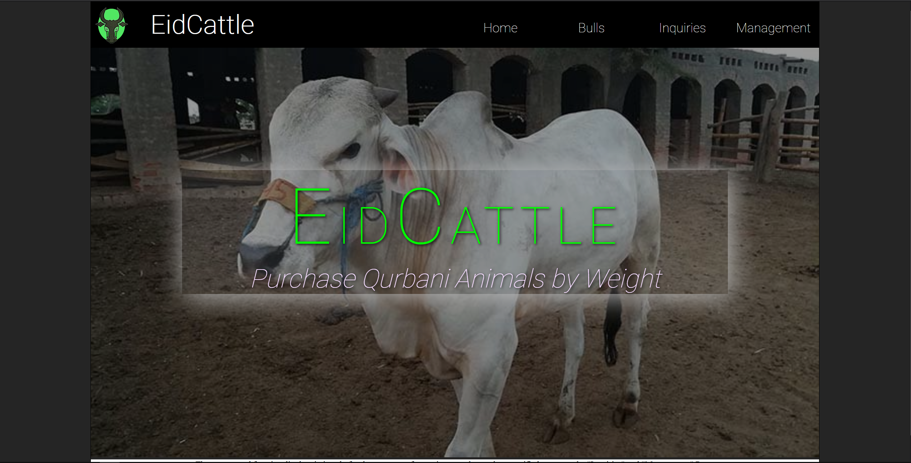
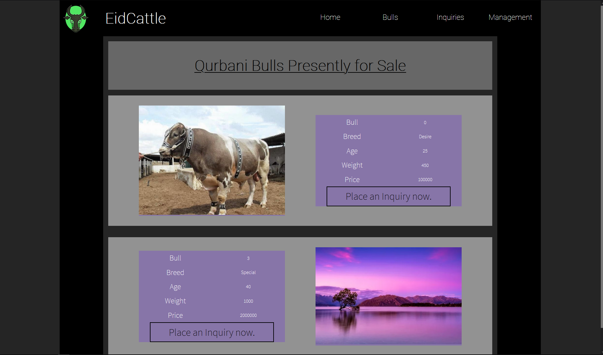
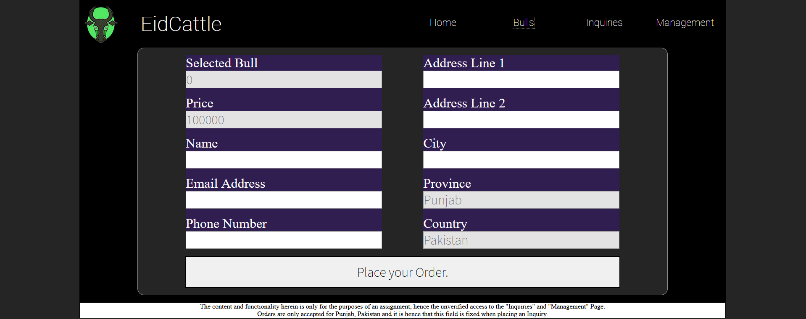
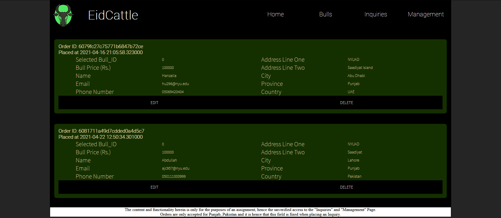
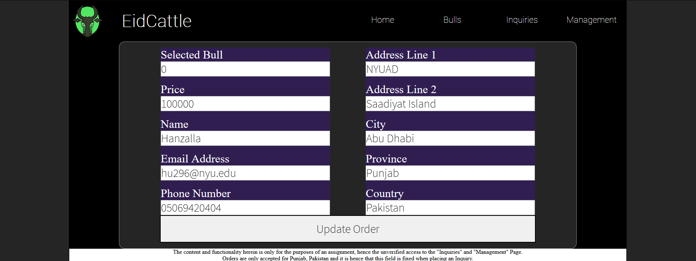
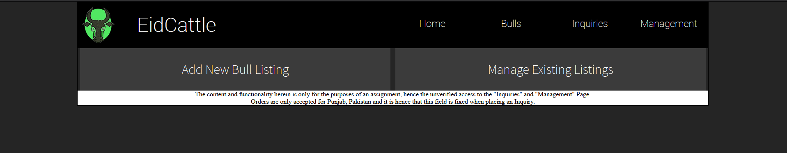
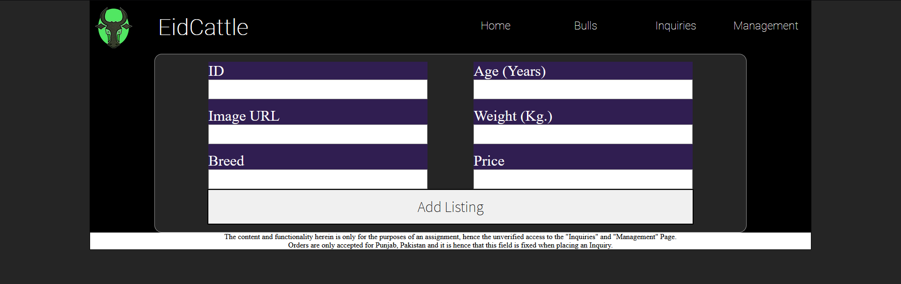
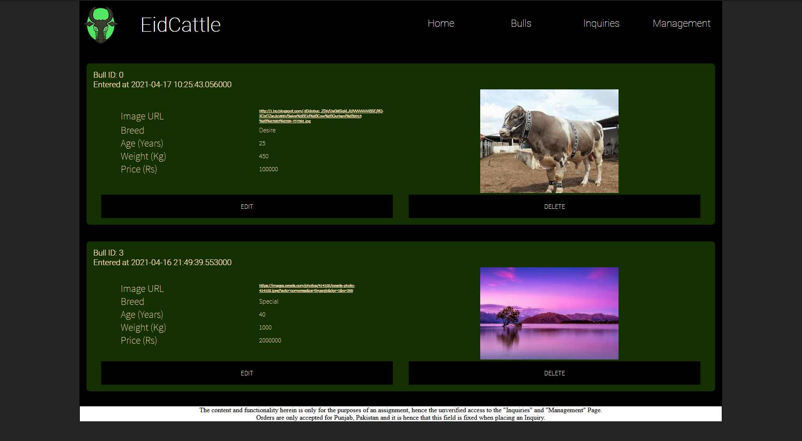

# EidCattle - Qurbani Bulls E-Commerce Platform

## Motivation

It is an annual religous obligation that Muslims are to offer sacrifice, in emulation of the Prophet Ibrahim. This sacrifice, specifically, comes in the form of purchasing a livestock animal (Bulls, Cows, Goats), slaughtering them, and then offering their meat to those economically disadvantaged.

With the present rise of the Corona Virus within Pakistan and its severity, markets for the purchase and sale of Qurbani animals (maandis) with their thousands of participants represent a significant risk. An E-Commerce platform such as this can assist in alleviating this risk, and increasing customer utility. 

## Description

The Web-App is composed of several distinct web-pages and collectively allow the placing of listings (which are products) by the Sales representative and the placing of inquiries (which are orders) by the Customers. 

### Homepage

The `Homepage` serves as an interface to access the function of the Web-App using the navigation-bar. 

### Bulls

The `Bull` page contains all the present Bull listings with their details. One can then press on the appropiate `Place an Inquiry Now.` button and be taken to the following `Inquiry Generate` page wherein one can place an Inquiry to be later contacted by the Sales representative.

Note, that outright ordering has not been enabled, since, there is a oft a great deal of negotiation in these transactions, with later delivery dates costing more since transport becomes increasingly expensive as the Eid arrives (and everyone must sacrifice some animal) and because there are greater feed costs.

### Inquiry Generate 

The form is used to place an Inquiry, and contains Customer details as well as the indentifying ID of the bull.
Note, that the fields Province and Country are non-modifiable since deliveries are only possible for the particular enterprise within the province, it is very difficult to transport live animals over large distances, especially since this entails wieght loss.

### Inquiry Management

The interface accessed from the `Inquiries` button in the navigation bar is used to manage the Inquiries that have been placed, allowing them to be modified, and deleted (after they have been processed) by the sales representative.

Pressing the `Edit` button for an inquiry, leads you to the following interface:

### Listing Management

The interface accessed from the `Listings` button in the navigation bar is used to select between two distinct options `Add New Bull Listing` and `Manage Existing Listings`. The former option allows the Sales representative allows the sales representative to add a New Bull for the purposes of sales, while the latter option allows one to modify all existing Bull Lisitngs.

#### Adding a New Bull Listing

This allows the entry of a new bull listing.

#### Managing Existing Bull Listings

This allows the management of existing listings.